# SEPARATION_ER_V5.md

- Project: 音楽聞き分けアプリ
- Version: Separation ER v5
- Updated: 2026-09-27
- Extends: ALIGNMENT_ER_V4.md

```mermaid
erDiagram
    PROJECT ||--o{ SEPARATION_RUN : owns
    RUN ||--|| SEPARATION_RUN : specializes
    ASSET ||--o{ SEPARATION_RUN : source_audio
    SCORE_REVISION ||--o{ SEPARATION_RUN : score_context
    ALIGNMENT_RUN ||--o{ SEPARATION_RUN : timing_context

    SEPARATION_RUN ||--o{ SEGMENT_JOB : plans
    ALIGNMENT_OCCURRENCE o|--o{ SEGMENT_JOB : scopes

    SEGMENT_JOB ||--o{ TARGET_DESCRIPTOR : describes
    SCORE_PART ||--o{ TARGET_DESCRIPTOR : score_target
    SCORE_INSTRUMENT o|--o{ TARGET_DESCRIPTOR : instrument_target

    TARGET_DESCRIPTOR ||--o{ PROMPT_VARIANT : renders

    SEGMENT_JOB ||--o{ SEPARATION_ATTEMPT : attempts
    SEPARATION_ATTEMPT o|--o{ SEPARATION_ATTEMPT : retry_parent

    SEPARATION_ATTEMPT ||--o{ SEPARATION_TARGET : channels
    TARGET_DESCRIPTOR ||--o{ SEPARATION_TARGET : factual_target
    PROMPT_VARIANT ||--o{ SEPARATION_TARGET : prompt_used

    SEPARATION_TARGET ||--o| SEPARATED_SEGMENT : produces
    ARTIFACT ||--|| SEPARATED_SEGMENT : stores

    SEPARATION_RUN {
        uuid id PK
        uuid run_id FK
        uuid project_id FK
        uuid audio_asset_id FK
        uuid score_revision_id FK
        uuid alignment_run_id FK
        string backend_family
        string model_name
        string model_version
        json plan_config_json
        string status
    }

    SEGMENT_JOB {
        uuid id PK
        uuid separation_run_id FK
        uuid alignment_occurrence_id FK
        int ordinal
        float source_start_sec
        float source_end_sec
        float context_left_sec
        float context_right_sec
        float overlap_left_sec
        float overlap_right_sec
        float alignment_confidence
        string status
        json metadata_json
    }

    TARGET_DESCRIPTOR {
        uuid id PK
        uuid segment_job_id FK
        uuid score_part_id FK
        uuid score_instrument_id FK
        string target_role
        string descriptor_version
        string instrument_label
        string source_part_label
        float sounding_pitch_min
        float sounding_pitch_max
        float pitch_median
        json note_sequence_json
        int event_count
        float activity_ratio
        int polyphony_max
        float active_start_sec
        float active_end_sec
        json evidence_json
    }

    PROMPT_VARIANT {
        uuid id PK
        uuid target_descriptor_id FK
        string strategy
        string template_version
        string language
        text text
        string generator
        string generator_version
        datetime generated_at
    }

    SEPARATION_ATTEMPT {
        uuid id PK
        uuid segment_job_id FK
        uuid parent_attempt_id FK
        int attempt_no
        string adapter_name
        string backend_profile
        json config_json
        int seed
        string status
        datetime started_at
        datetime finished_at
        float runtime_sec
        bigint peak_vram_bytes
        string error_type
        text error_message
        text traceback_text
        json provenance_json
    }

    SEPARATION_TARGET {
        uuid id PK
        uuid separation_attempt_id FK
        uuid target_descriptor_id FK
        uuid prompt_variant_id FK
        int channel_index
        string output_key
    }

    SEPARATED_SEGMENT {
        uuid id PK
        uuid separation_target_id FK
        uuid artifact_id FK
        int sample_rate
        int channels
        float duration_sec
        json metadata_json
    }
```

## 制約

1. Audio-SDS baselineのSegmentJobは10秒以下。
2. Descriptorは譜面/解析事実。Prompt文字列と分離する。
3. ScorePart名とpromptを同一fieldにしない。
4. 1 Descriptorへ複数PromptVariant。
5. failed SeparationAttemptを再利用しない。
6. output Artifactから元AudioAsset/AlignmentRun/PromptVariantまで追跡可能。
7. Performer未確定でもScorePart単位で動く。
8. complementもTargetDescriptorとして履歴化する。
9. 同一楽器個人分離の成功をpart番号だけから仮定しない。
